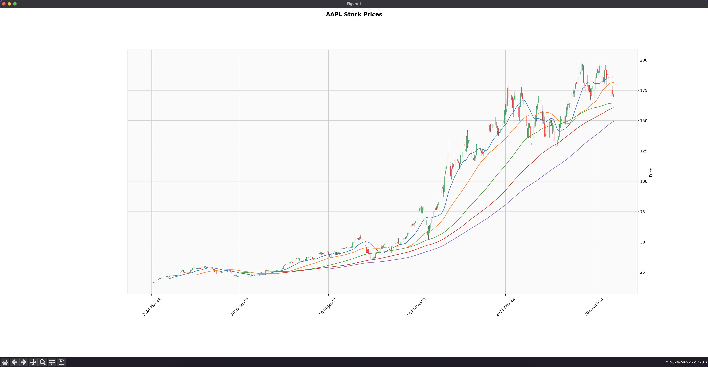

# Mustafa Project

Mustafa Project - is a financial market analysis and stock price prediction project.

### Table of Contents

- [About](#about)
- [Roadmap](#roadmap)

## About

The project is developed using _Python_ programming language, _Yahoo Finance_ and _Alpha Vantage_ APIs to get historical stock data, _Prophet_ API for stock price forecasting, _Pandas_ and _Numpy_ libraries for data manipulation, _Matplotlib_ and _Mplfinance_ libraries for data visualization.

## Features

### Historical Financial Data

Historical financial data is a collection of past financial data, which is used to analyze trends, compare companies, and forecast future financial performance. The data includes information on revenue, expenses, profits, assets, liabilities, and other financial metrics.

#### Stock Price Chart

The stock price chart is a graphical representation of a stock's price movement over a specific period of time. It shows the opening, closing, high, and low prices of a stock on a daily, weekly, monthly, or yearly basis.

  
Show

  

## Roadmap

- [ ] Historical Financial Data
- [ ] Intrinsic Value
- [ ] Stock Price Prediction

> "I predict stock prices with the accuracy of a weather forecast: always sunny unless it rains." - Mustafa

